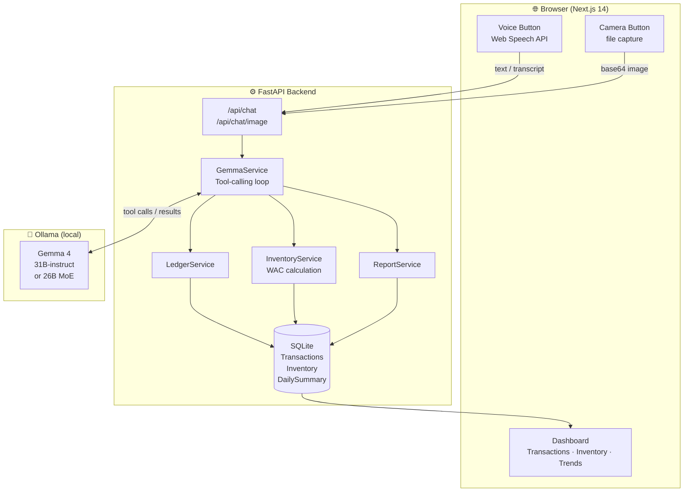

# 📒 Susu Books

**Voice-first AI business copilot for informal economy workers**

> *"Susu"* (Twi/Ga) — a savings collective rooted in trust and community accounting.

Susu Books lets market traders, street vendors, and smallholder farmers record sales, purchases, and expenses by simply **speaking in their own language** — no smartphone literacy required, no internet needed after setup. Gemma 4 running locally via Ollama understands the message, extracts structured data, and updates the ledger automatically.

---

## 🎥 Demo

**Ama's Wednesday at Makola Market, Accra** — 10-step automated demo:

| Step | What Ama says | What happens |
|------|--------------|--------------|
| 1 | "I bought 10 bags of rice from Kofi for 120 cedis each" | Purchase recorded, inventory updated |
| 2 | "Sold 3 bags of rice at 180 cedis each to Maame" | Sale recorded, profit calculated |
| 3 | "I bought 4 crates of tomatoes from Abena for 50 each" | Stock restocked |
| 4 | "Sold 2 crates of tomatoes at 80 cedis each" | Revenue logged |
| 5 | "Transport to market today cost 15 cedis" | Expense categorized |
| 6 | "Sold 8 kg of onions at 12 cedis per kg" | Quantity × price computed |
| 7 | "I bought 10 liters of palm oil from Abena for 35 each" | WAC inventory updated |
| 8 | "Sold 5 bunches of plantains at 38 cedis each" | Sale recorded |
| 9 | "Market stall fee today was 8 cedis" | Overhead tracked |
| 10 | "How did I do today?" | Full daily P&L summary |

Click **"Watch Demo — Ama's Day"** in the bottom bar to run the demo automatically, or speak/type any of the above yourself.

---

## ✨ Features

- **Voice input** — Web Speech API with one-tap recording; falls back gracefully to keyboard
- **Camera / OCR** — Photograph a handwritten receipt and Gemma 4 extracts all line items
- **7 AI functions** — `record_purchase`, `record_sale`, `record_expense`, `check_inventory`, `daily_summary`, `weekly_report`, `export_credit_profile`
- **Multi-language** — English, Twi (Akan), Hausa, Nigerian Pidgin, Swahili
- **100% offline after setup** — Gemma 4 runs locally via Ollama; SQLite stores all data
- **Low-stock alerts** — Automatic warnings when items fall below threshold
- **Weekly trend** — Pure SVG sparkline showing 7-day profit trajectory
- **Credit profile** — Export a lightweight financial summary for mobile-money lenders

---

## 🏗 Architecture



### How tool calling works

Susu Books sends a system prompt plus all 7 function schemas to Gemma 4. Gemma returns either a plain text reply or a `tool_use` block. The backend executes the function, feeds the result back, and iterates up to 10 times until Gemma returns a final natural-language confirmation.

```
User: "Sold 3 bags of rice at 180 cedis"
  → Gemma: tool_call { name: "record_sale", args: { item: "rice", qty: 3, price: 180 } }
  → Backend executes record_sale → writes DB → returns { success: true, revenue: 540 }
  → Gemma: "Done! You sold 3 bags of rice for ₵540. Your profit on this batch is ₵180."
```

---

## 🚀 Quick Start

### Prerequisites

| Dependency | Version | Notes |
|-----------|---------|-------|
| [Ollama](https://ollama.ai/download) | latest | Runs Gemma 4 locally |
| Docker + Docker Compose | v2+ | Or: Python 3.11 + Node 20 |
| Disk space | ~21 GB free | For Gemma 4 31B model |

### One-command setup (Docker)

```bash
git clone https://github.com/YOUR_USERNAME/susu-books.git
cd susu-books

# 1. Install Ollama and pull the model (once, ~20 min on first run)
ollama pull gemma4:31b-instruct

# 2. Start everything
bash setup.sh
```

Open **http://localhost:3000** — the app loads with 2 weeks of pre-seeded demo data.

### Manual setup (no Docker)

```bash
# Terminal 1 — Backend
cd backend
python3 -m venv .venv && source .venv/bin/activate
pip install -r requirements.txt
cp .env.example .env          # edit OLLAMA_MODEL if needed
python seed.py                # optional: load demo data
uvicorn main:app --port 8000 --reload

# Terminal 2 — Frontend
cd frontend
npm install
echo "NEXT_PUBLIC_API_URL=http://localhost:8000" > .env.local
npm run dev
```

Open **http://localhost:3000**

### setup.sh flags

| Flag | Effect |
|------|--------|
| `--no-docker` | Use Python venv + npm dev instead of Docker |
| `--no-seed` | Skip loading demo data |
| `--dev` | Same as `--no-docker` but with hot-reload |

---

## 📁 Project Structure

```
susu-books/
├── backend/
│   ├── main.py                 # FastAPI app, CORS, lifespan
│   ├── config.py               # Settings (pydantic-settings)
│   ├── database.py             # Async SQLAlchemy + aiosqlite
│   ├── models.py               # ORM: Transaction, Inventory, DailySummary
│   ├── schemas.py              # Pydantic v2 I/O schemas
│   ├── seed.py                 # 14-day demo data generator
│   ├── requirements.txt
│   ├── Dockerfile
│   ├── routers/
│   │   ├── ai.py               # POST /api/chat, /api/chat/image
│   │   ├── transactions.py     # CRUD for transactions
│   │   ├── inventory.py        # Inventory read/update
│   │   └── reports.py          # Daily/weekly summaries, credit profile
│   └── services/
│       ├── gemma_service.py    # Ollama tool-calling orchestration
│       ├── ledger_service.py   # Purchase/sale/expense writes
│       ├── inventory_service.py # WAC stock management
│       └── report_service.py   # P&L aggregations
│
├── frontend/
│   ├── src/
│   │   ├── app/
│   │   │   ├── page.tsx        # Main dashboard (three-zone layout)
│   │   │   ├── layout.tsx      # Metadata, fonts, viewport
│   │   │   └── globals.css     # Tailwind + custom keyframes
│   │   ├── components/
│   │   │   ├── VoiceButton.tsx
│   │   │   ├── CameraButton.tsx
│   │   │   ├── TransactionFeed.tsx
│   │   │   ├── TransactionCard.tsx
│   │   │   ├── DailySummary.tsx
│   │   │   ├── WeeklySpark.tsx
│   │   │   ├── InventoryPanel.tsx
│   │   │   ├── ActionPanel.tsx
│   │   │   ├── ChatBubble.tsx
│   │   │   ├── LanguageSelector.tsx
│   │   │   ├── LoadingPulse.tsx
│   │   │   ├── OllamaOfflineScreen.tsx
│   │   │   └── DemoMode.tsx
│   │   ├── hooks/
│   │   │   ├── useVoiceInput.ts
│   │   │   ├── useVoiceOutput.ts
│   │   │   └── useApi.ts
│   │   └── lib/
│   │       ├── api.ts
│   │       ├── types.ts
│   │       └── theme.ts
│   ├── public/demo/            # Sample receipts for OCR testing
│   │   ├── receipt-supplier.html
│   │   ├── receipt-handwritten.html
│   │   └── stockcount.html
│   ├── tailwind.config.ts
│   ├── next.config.js
│   └── Dockerfile
│
├── docker-compose.yml
├── setup.sh
└── README.md
```

---

## 🌍 Language Support

| Language | BCP-47 code | Speech recognition | TTS |
|----------|------------|-------------------|-----|
| English | `en-GH` | ✅ | ✅ |
| Twi (Akan) | `ak-GH` | ✅ (Chrome) | ⚠️ fallback to en-GH |
| Hausa | `ha-NG` | ✅ (Chrome) | ✅ |
| Nigerian Pidgin | `en-NG` | ✅ | ✅ |
| Swahili | `sw-KE` | ✅ | ✅ |

Gemma 4 understands multilingual input naturally — users can mix languages in a single sentence (code-switching is common in West African markets).

---

## 🔧 API Reference

| Method | Path | Description |
|--------|------|-------------|
| `POST` | `/api/chat` | Send a text message to Gemma 4 |
| `POST` | `/api/chat/image` | Send a receipt image for OCR + extraction |
| `GET`  | `/api/health` | Check backend + Ollama status |
| `GET`  | `/api/transactions` | List transactions (filter by date/type) |
| `GET`  | `/api/inventory` | Current stock levels |
| `GET`  | `/api/inventory/check/alerts` | Low-stock items |
| `GET`  | `/api/reports/summary/daily` | Today's P&L |
| `GET`  | `/api/reports/summary/weekly` | 7-day trend data |
| `GET`  | `/api/reports/export/credit-profile` | Lightweight credit summary |

Interactive docs available at **http://localhost:8000/docs** (Swagger UI).

---

## 🎨 Design System

The UI uses an **earth-tone palette** inspired by Ghana's markets — warm greens, amber, and natural paper tones that feel familiar rather than clinical.

| Token | Hex | Usage |
|-------|-----|-------|
| `primary-900` | `#1B5E20` | Header, voice button, CTAs |
| `accent-800` | `#E65100` | Demo mode, amber alerts |
| `background` | `#FAFAF5` | App background (off-white) |
| `text-primary` | `#1C1B1A` | Body text |
| `success` | `#2E7D32` | Sale transactions |
| `danger` | `#C62828` | Low stock, expenses |

Typography: **DM Sans** (UI) + **DM Mono** (numbers/code).

---

## 🧪 Testing the OCR Feature

Open the demo receipts in your browser, take a screenshot (or print-to-PDF), then photograph the screen with the camera button in Susu Books:

- `public/demo/receipt-supplier.html` — Printed thermal receipt from Kofi's Wholesale
- `public/demo/receipt-handwritten.html` — Handwritten sales ledger on ruled paper
- `public/demo/stockcount.html` — Stock count on cardboard with tally marks

Gemma 4 will extract all transactions and offer to record them.

---

## ⚙️ Environment Variables

### Backend (`backend/.env`)

```env
OLLAMA_BASE_URL=http://localhost:11434
OLLAMA_MODEL=gemma4:31b-instruct
DATABASE_URL=sqlite:///susu_books.db
DEBUG=false
```

### Frontend (`frontend/.env.local`)

```env
NEXT_PUBLIC_API_URL=http://localhost:8000
```

---

## 🏆 Hackathon

Built for the **[Gemma 4 Good Hackathon](https://www.kaggle.com/competitions/gemma-4-good)** on Kaggle (deadline May 18, 2026).

**Track**: Social Good / Financial Inclusion

**Why Gemma 4?**
- 128K context window handles long transaction histories and multi-turn conversations
- Multimodal vision: photograph receipts, handwritten notes, cardboard stock counts
- Efficient MoE architecture (`gemma4:26b-a4b-instruct`) makes offline deployment viable on modest hardware
- Multilingual understanding without fine-tuning — critical for West African languages

---

## 📄 License

Apache 2.0 — see [LICENSE](LICENSE).

Models: [Gemma 4](https://ai.google.dev/gemma) is distributed under the [Gemma Terms of Use](https://ai.google.dev/gemma/terms).

---

## 🙏 Acknowledgements

- **Google DeepMind** — Gemma 4 model family
- **Ollama** — making local LLM deployment painless
- **Market women everywhere** who have been doing mental bookkeeping for generations — this is for you.
