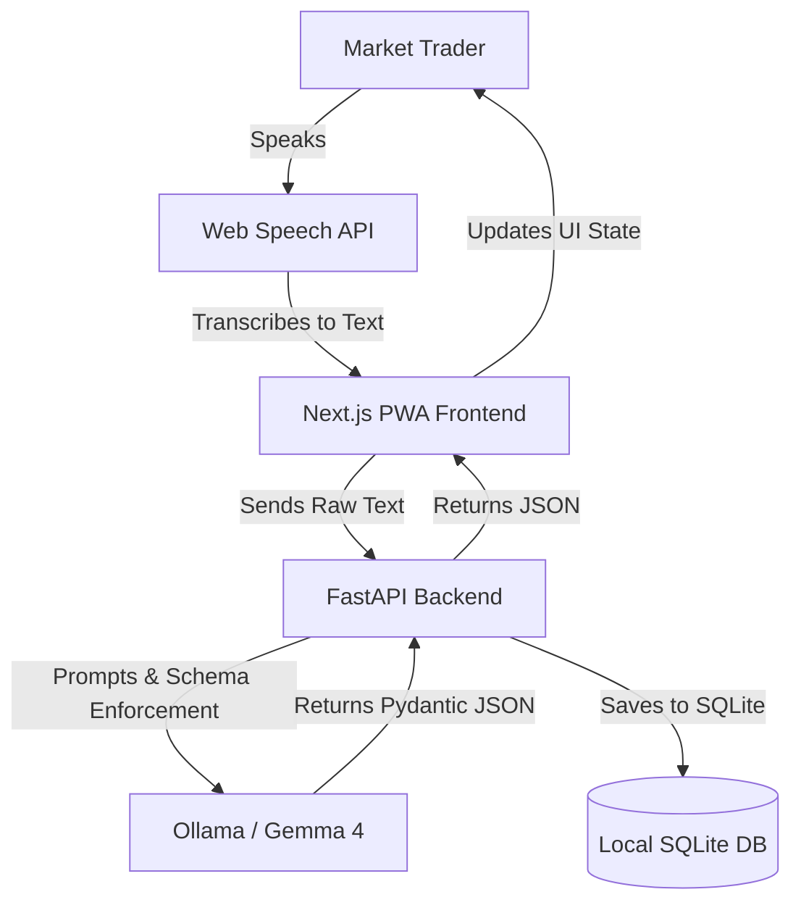

# Susu Books 🌍

<p align="center">
  
</p>

<p align="center">
  <a href="https://susu-books-frontend.onrender.com" target="_blank"><strong>✨ Explore the Live Demo ✨</strong></a>
</p>

**Susu Books** is a voice-first, entirely offline AI ledger application designed to bring modern business intelligence to informal market traders across the globe. By leveraging **Gemma 4** running locally via **Ollama**, it replaces complex accounting software with a natural, multi-lingual, and multi-currency voice interface that requires zero internet connection.

## 🏆 Kaggle Gemma 4 Impact Challenge Submission
This project is built for the Gemma 4 Impact Challenge under the **Digital Equity & Inclusivity** track, utilizing the **Ollama Special Technology Track** for edge-based, offline AI inference.

## 🏗 System Architecture

Susu Books uses a highly decoupled, offline-first architecture to ensure resilience in low-connectivity environments.


```mermaid
graph TD
    A[Market Trader] -->|Speaks| B[Web Speech API]
    B -->|Transcribes to Text| C[Next.js PWA Frontend]
    C -->|Sends Raw Text| D[FastAPI Backend]
    D -->|Prompts & Schema Enforcement| E[Ollama / Gemma 4]
    E -->|Returns Pydantic JSON| D
    D -->|Saves to SQLite| F[(Local SQLite DB)]
    D -->|Returns JSON| C
    C -->|Updates UI State| A
```

### Core Components
1. **Frontend (Next.js PWA):** A fast, glassmorphic UI utilizing the browser's native Web Speech API. We implemented a fallback system that captures phonetic loanwords using regional dialects (e.g., `en-GH`), allowing Gemma to act as the ultimate NLP parser.
2. **Backend (Python FastAPI):** A lightweight asynchronous server that manages database connections and heavily enforces **Pydantic schemas** to ensure Gemma 4 outputs strict JSON transactions instead of conversational text.
3. **AI Engine (Ollama + Gemma 4):** The local intelligence hub. Running completely offline, Gemma performs Zero-Shot Schema Extraction and Named Entity Recognition to map messy speech to canonical inventory items.
4. **Database (SQLite):** Ensures zero network latency and sovereign data privacy.

## ✨ Key Features
- **Zero-Internet AI:** Fully local speech parsing using Gemma 4 on edge hardware.
- **Global Inclusivity:** Dynamic multi-lingual support and real-time multi-currency formatting.
- **Multi-Trader Profiles:** PIN-locked, tactile profile management for shared family devices.
- **Actionable Insights:** Daily profit calculation, low-stock alerts, and ledger export.

## 🚀 Getting Started

### Prerequisites
- Node.js (v18+)
- Python (3.11+)
- [Ollama](https://ollama.com) installed and running locally with Gemma:
  ```bash
  ollama run gemma
  ```

### 1. Start the Backend
```bash
cd backend
python -m venv .venv
source .venv/bin/activate
pip install -r requirements.txt
python main.py
```
*The backend runs on `http://localhost:8000`.*

### 2. Start the Frontend
```bash
cd frontend
npm install
npm run dev
```
*The frontend runs on `http://localhost:3000`.*

## 💻 Tech Stack
- **AI:** Gemma 4, Ollama
- **Backend:** FastAPI, SQLite, Pydantic, SQLAlchemy
- **Frontend:** Next.js 14, React, Tailwind CSS
- **Deployment Environments:** Render, Vercel

## 📄 License
MIT License
